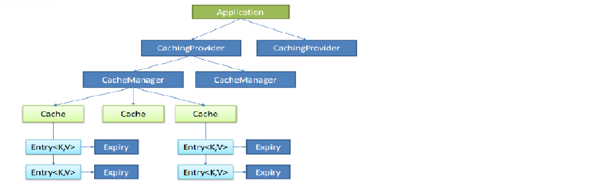

# SpringBoot高级部分

>缓冲、消息、检索、任务、安全、分布式、监控管理、部署

***

## 一、缓冲

### 1.JSR-107（不怎么用）

Java Caching定义了5个核心接口，分别是CachingProvider, CacheManager, Cache, Entry
和 Expiry。

* CachingProvider定义了创建、配置、获取、管理和控制多个CacheManager。一个应用可以在运行期访问多个CachingProvider。
* CacheManager定义了创建、配置、获取、管理和控制多个唯一命名的Cache，这些Cache存在于CacheManager的上下文中。一个CacheManager仅被一个CachingProvider所拥有。
* Cache是一个类似Map的数据结构并临时存储以Key为索引的值。一个Cache仅被一个CacheManager所拥有。
* Entry是一个存储在Cache中的key-value对。
* Expiry 每一个存储在Cache中的条目有一个定义的有效期。一旦超过这个时间，条目为过期的状态。一旦过期，条目将不可访问、更新和删除。缓存有效期可以通过ExpiryPolicy设置。



```xml
<!--maven依赖-->
<dependency>
	<groupId>javax.cache</groupId>
	<artifactId>cache-api</artifactId>
</dependency>
```


### 2.spring缓冲抽象


### 3.redis整合


***

## 二、消息


***

## 三、检索


***

## 四、任务


***

## 五、安全


***

## 六、分布式


***

## 七、监控管理


***

## 八、部署

