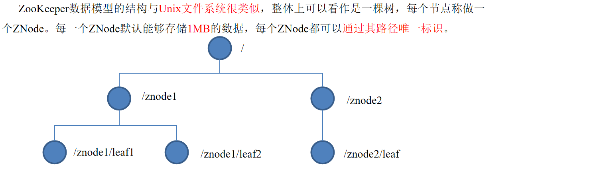
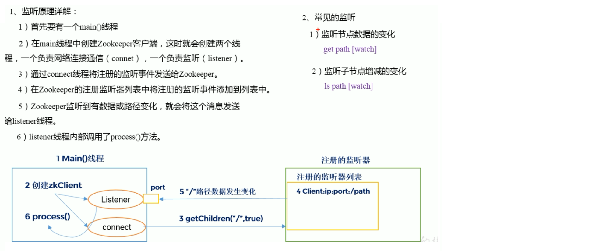
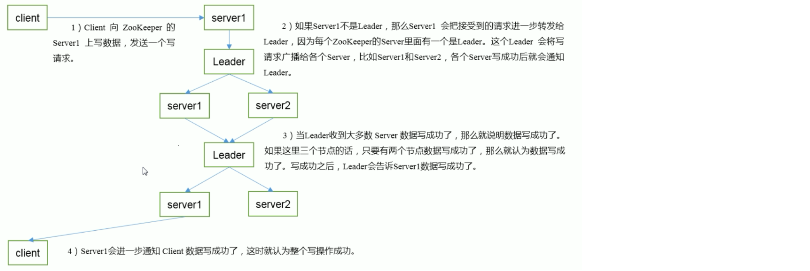

# Zookeeper

>一个开源的分布式的，为分布式应用**提供协调**服务的Apache项目
>
>动物管理员
>
>​										author->xiaokai


### 一、简介

​	<u>zookeeper统一管理集群的分布式系统</u>

#### 1.工作机制

​	zookeeper从设计模式来理解：是一个基于观察者模式的分布式服务管理系统，它***负责存储和管理大家都关心的数据***，然后***接受观察者的注册***，一旦这些数据的状态发生变化，zookeeper就将***负责通知已经在zoopeeker上注册的那些观察者***做出相应的反应。

​	zookeeper =  文件系统 + 通知系统

* 文件系统：存储监听的服务信息（服务）
* 通知系统：负责将监听的服务信息变化（服务状态变化）通知给订阅该服务消息的客户端（软件）

#### 2.zookeeper特点:

1. Zookeeper：一个领导者（leader），多个跟随者（follower）组成的集群；
2. Leader负责进行投票的发起和决议，更新系统状态；
3. Follower用于接收客户请求并向客户端返回结果，在选举Leader过程中参与投票；
4. **集群中只要有半数以上节点存活，Zookeeper集群就能正常服务；**
5. 全局数据一致：每个server保存一份相同的数据副本，client无论连接到哪个；server，数据都是一致的；
6. 更新请求顺序进行，来自同一个client的更新请求按其发送顺序依次执行；
7. 数据更新原子性，一次数据更新要么成功，要么失败；
8. 实时性，在一定时间范围内，client能读到最新数据。

#### 3.zookeeper数据结构

​	

#### 4.zookeeper使用场景

​	提供的服务包括：统一命名服务、统一配置管理、统一集群管理、服务器节点动态上下线、软负载均衡等。

​	详见外侧尚硅谷笔记文件夹中

#### 5.[zookeeper下载地址](https://zookeeper.apache.org/)

***


### 二、本地模式安装部署（单机模式做测试）

#### 1.安装

1. 安装前准备

   * jdk
   * 压缩包拷贝到centos的opt目录下
   * 解压到指定目录

2. 配置修改

   * 解压文件夹下conf下有一个配置文件zoo-samp.cfg改名为zoo.cfg
   * 修改zoo.cfg中dataDir=/opt/zookeeper-3.4.10/zkData
   * /opt/zookeeper-3.4.10/下创建文件夹zkData

3. 操作zookeeper

   ​	bin目录下:

   * 启动:	./zkServer.sh start
   * 查看进程:        ps -ef | grep zookeeper
   * 查看状态:        ./zkServer.sh status
   * 启动客户端:     ./zkCli.sh
   * 退出客户端:     quit
   * 停止zookeeper:     ./zkServer.sh stop

#### 2.配置文件参数详解

​	LF=Leader+Follower

* tickTime=2000:通信心跳数,单位毫秒

  * Zookeeper使用的基本时间，服务器之间或客户端与服务器之间维持心跳的时间间隔，也就是每个tickTime时间就会发送一个心跳

    它用于心跳机制，并且设置最小的session超时时间为两倍心跳时间。(session的最小超时时间是2*tickTime)。

* initLimit=10:LF初始通信时限数

  * 集群中的follower与leader之间初始连接时能容忍的最多心跳数（tickTime的数量），限定集群中的Zookeeper服务器连接到Leader的时限

    投票选举新leader的初始化时间。

    Follower在启动过程中,会从Leader同步所有最新数据,然后确定自己能够对外服务的起始状态.Leader允许F在initLimit时间内完成这个工作

* syncLimit=5:LF同步通信时限

  * 集群中Leader与Follower之间的最大响应时间单位，假如响应超过syncLimit * tickTime，Leader认为Follwer死掉，从服务器列表中删除Follwer。

    在运行过程中，Leader负责与ZK集群中所有机器进行通信，例如通过一些心跳检测机制，来检测机器的存活状态。

    如果L发出心跳包在syncLimit之后，还没有从F那收到响应，那么就认为这个F已经不在线了。

* dataDir=///:数据文件目录+数据持久化路径

  * 保存内存数据库快照信息的位置，如果没有其他说明，更新的事务日志也保存到数据库

* clientPort=2181:客户端连接服务端口号

***


###三、Zookeeper内部原理

#### 1.选举机制

​	每个server都有自己的id。

​	开始选举，先投自己一票，发现自己票数太低当不了leader，就把票数投给id比自己大的，直到产生leader

#### 2.节点类型

* 持久（Persistent）：客户端和服务器断开连接后，创建的节点不删除

  * 持久化目录节点

    ​	客户端与zookeeper断开连接后,该节点依然存在

  * 持久化顺序编号目录节点

    ​	客户端与zookeeper断开连接后,该节点依旧存在,只是zookeeper给该节点名称进行顺序编号(为了记录事件执行顺序)

* 短暂（Ephemeral）：客户端和服务器断开连接后，创建的节点自己删除

  * 临时目录节点

    ​	客户端与zookeeper断开连接后,该节点立刻被删除

  * 临时顺序编号目录节点

    ​	客户端与zookeeper断开连接后,该节点被立刻删除,只是zookeeper给该节点名称进行顺序编号(为了记录事件执行顺序)

#### 3.stat结构体(没什么用,一般不用,了解范围)

* czxid- 引起这个znode创建的zxid，创建节点的事务的zxid
* ctime - znode被创建的毫秒数(从1970年开始)
* mzxid - znode最后更新的zxid
* mtime - znode最后修改的毫秒数(从1970年开始)
* pZxid-znode最后更新的子节点zxid
* cversion - znode子节点变化号，znode子节点修改次数
* dataversion - znode数据变化号
* aclVersion - znode访问控制列表的变化号
* ephemeralOwner- 如果是临时节点，这个是znode拥有者的session id。如果不是临时节点则是0
* **dataLength- znode的数据长度**
* **numChildren - znode子节点数量**

#### 4.监听器原理(面试重点)



#### 5.写数据流程



***


### 四、Zookeeper实战（重点）

#### 1.分布式安装部署

1. 集群规划

   ​	在zookeeper001、zookeeper002和zookeeper003三个服务器节点上分别部署Zookeeper。

2. 解压安装

   ​	安装到/opt/目录下:解压->修改conf下的配置文件zoo_samp.cfg为zoo.cfg->/opt/zookeeper-3.4.10/下创建文件夹zkData->修改配置文件中dataDir=/opt/zookeeper-3.4.10/zkData

3. 配置三个zoo.cfg文件

   Server.A=B:C:D

   * A是一个数字，表示这个是第几号服务器；
   * B是这个服务器的ip地址；
   * C是这个服务器与集群中的Leader服务器交换信息的端口；
   * D是万一集群中的Leader服务器挂了，需要一个端口来重新进行选举，选出一个新的Leader，而这个端口就是用来执行选举时服务器相互通信的端口。
   * ***集群模式下配置一个文件myid，这个文件在dataDir目录下，这个文件里面有一个数据就是A的值，Zookeeper启动时读取此文件，拿到里面的数据与zoo.cfg里面的配置信息比较从而判断到底是哪个server。***

   三个服务器中zookeeper同样的具体配置:

   ```
   server.2=192.168.1.111:2888:3888
   server.3=192.168.1.112:2888:3888
   server.4=192.168.1.113:2888:3888
   ```

4. 集群操作

   * 在/opt/module/zookeeper-3.4.10/zkData目录下创建一个myid的文件:touch myid

   * 编辑myid文件:  在文件中添加与server对应的编号：如2

   * 拷贝配置好的zookeeper到其他机器上

     ​	scp -r zookeeper-3.4.10/ root@hadoop103.atguigu.com:/opt/app/

     ​	scp -r zookeeper-3.4.10/ root@hadoop104.atguigu.com:/opt/app/

     ​	并分别修改myid文件中内容为3、4

   * 分别启动zookeeper

   * 分别查看zookeeper状态:  ./zkServer.sh status           可以查看哪个是follower哪个是leader

#### 2.客户端命令操作(重要)

* 启动客户端
  * ./zkCli.sh

* 显示所有操作命令
  * [zk: localhost:2181(CONNECTED) 1] **help**

* 查看当前zNode中所包含的内容
  * ls /

* 查看当前节点数据并能看到深层次数等数据
  * ls2 /
    * 查出结果是一个**stat结构体**,内容如下:
    * cZxid = 0x0
      ctime = Thu Jan 01 08:00:00 CST 1970
      mZxid = 0x0
      mtime = Thu Jan 01 08:00:00 CST 1970
      pZxid = 0x0
      cversion = -1
      dataVersion = 0
      aclVersion = 0
      ephemeralOwner = 0x0
      dataLength = 0
      numChildren = 1

* 创建普通节点

  * create /app1 "hello app1"
  * create /app1/server101 "192.168.1.101"

* 获得节点的值

  * get /app1

    * 结果也是一个stat结构体:内容如下:

    * hello app1

      cZxid = 0x20000000a
      ctime = Mon Jul 17 16:08:35 CST 2017
      mZxid = 0x20000000a
      mtime = Mon Jul 17 16:08:35 CST 2017
      pZxid = 0x20000000b
      cversion = 1
      dataVersion = 0
      aclVersion = 0
      ephemeralOwner = 0x0
      dataLength = 10
      numChildren = 1

* 创建短暂节点

  * create **-e** /app-emphemeral 8888

* 创建带序号的节点

  * create **-s** /app2/aa 888
    * 实际创建的节点是: /app2/aa0000000000
    * 如果原节点下有1个节点，则再排序时从1开始，以此类推。

* 修改节点数据值

  * set /app1 999

* 节点的值变化监听

  * get /app1 watch

    * zookeeper集群中所有节点都是共享的,所以可以在不同的host上监听另一个host的节点

    * 这种方式只是监听节点的值的变化

    * 例子:  set /app1  777

      ​	    WATCHER::
      ​	    WatchedEvent state:SyncConnected type:NodeDataChanged path:/app1

* 节点的子节点变化监听(路径变化)

  * ls /app1 watch
    * 道理同上

* 删除节点

  * delete /app1/bb

* 递归删除节点

  * rmr /app2
    * 实际就是删除路径

* 查看节点状态

  * stat /app1
    * 查看app1节点的stat结构体

#### 3.API应用实战（eclipse）

​	具体看尚硅谷资料和代码包中TestZookeeper.java

#### 4.案例实战

* 监听服务器节点动态上下线案例
  * 具体看尚硅谷资料和代码包中DistributeServer.java和DistributeClient.java

***


### 五、zookeeper一般面试题

#### 1.简述zookeeper的选举机制？

#### 2.zookeeper的监听原理是什么？

#### 3.zookeeper的部署方式有几种？分别是什么？集群中的角色有哪些？集群最少需要几台机器？

#### 4.zookeeper的常用命令？